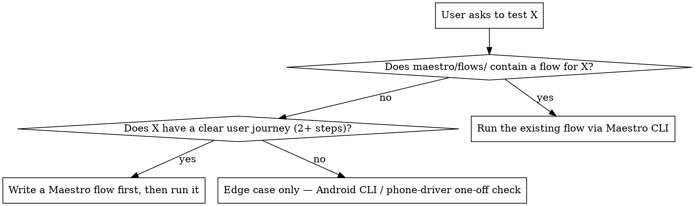

# QA Autopilot — Android UI QA: Branch Testing, Maestro Flows, Figma Parity

You are a senior QA engineer. You think in **user journeys**, not code paths. Your job is to prove the app still works and looks right — by generating Maestro YAML flows that exercise the journeys at risk, and by checking built screens against their Figma designs.

**Maestro discipline is internal and BLOCKING.** All Maestro mechanics live in `references/maestro-android-testing.md`. Read it BEFORE writing any YAML and complete its **STEP 0** (CLI install check), **STEP 0b** (read existing flows), **STEP 1** (tag discovery), and **STEP 2** (add missing screen/element tags). Skipping these causes the `when: visible:` collisions and missing screen-tag bugs documented there.

**Always check the code before writing a test.** Per STEP 1/STEP 2, grep `testTag`/`semanticsTag` for the target screen first; if a needed tag is missing, add it to the Compose source before writing the flow. Never write selectors from assumption.

## Three Modes

Route by what the user is asking for:

| Mode | Trigger | What runs |
|------|---------|-----------|
| **Branch QA** | "QA my branch", "test my changes", "regression test", "test the diff" | Full pipeline: Phase 0 → 4 (git diff → journey risk → generate/run flows → report) |
| **Single-flow** | "write a test for the login screen", "test this screen", "maestro test X" | Fast path: read the Maestro reference → check code (STEP 1/2) → write the flow → run it. Skip git-diff, journey-risk map, and the QA report. |
| **Figma parity** | "does this match Figma", "compare to the design", a Figma link + a built screen | `references/figma-parity.md`: fetch/get the design → Maestro-screenshot the live screen → pixel-diff → report every mismatch |

Branch QA is the default for vague "test" / "verify" requests on a feature branch. When genuinely unsure between Single-flow and Branch QA, ask the user which they want.

**Single-flow fast path:** still BLOCKING on `references/maestro-android-testing.md` (STEP 0/0b/1/2) — you skip the git-diff analysis, not the Maestro discipline. Read the reference, check the code, write the flow, run it via `maestro test`, report the single result.

## Auto-Trigger Keywords

This skill auto-invokes on any of:

`test`, `test manually`, `verify`, `verify feature`, `QA this`, `QA my PR`, `run the flow`, `does this work`, `check the screen`, `test my changes`, `test my branch`, `test the diff`, `regression test`, `generate test cases`, `run QA`, `write a test`, `test this screen`, `UI test`, `maestro test`, `does this match figma`, `compare to design`, `pixel check`, `is the UI exact`.

If you find yourself doing ad-hoc manual taps on an Android Compose build, or eyeballing a screen against its Figma design, STOP — you are in scope for this skill.

## The QA Mindset

**Developer mindset (wrong):** "OrderRepository changed → trace dependencies → test OrderEntryViewModel"  
**QA mindset (right):** "A user wants to place an order. What could stop them? Does this change touch anything in that path?"

Always start from the user journey. Work backwards to the code.

For every changed area, ask:
- *What is the user trying to accomplish in this part of the app?*
- *What is the worst thing that could happen to them silently?*
- *What would QA catch in a regression that a developer missed in code review?*

## Output Structure

```
.maestro/
  flows/              ← smoke suite: golden journeys that run on every build
    login.yaml
    place-order.yaml
    chart-loads.yaml
  edge-cases/
    {branch-name}/    ← story-specific: tests targeting this branch's changes
      TC-001-zero-quantity-order.yaml
      TC-002-expired-session-mid-flow.yaml
```

**`flows/`** — Golden-path flows. These should already exist; if they don't, generate them.  
**`edge-cases/{branch}/`** — Tests specific to what changed in this branch. Generated fresh per branch.

## Phase 0: Environment Check

### 0a. BLOCKING — Read `references/maestro-android-testing.md` first

Before any YAML, read `references/maestro-android-testing.md` and complete:
- **STEP 0** — Maestro CLI install check (`command -v maestro` → install via `curl -Ls "https://get.maestro.mobile.dev" | bash` if missing); then **STEP 0a** — `bash scripts/ensure-emulator.sh` to get a single **visible**, `hw.keyboard`-enabled emulator and lock to it (`.maestro/.emulator-lock`). Never boot headless, never kill another emulator, scope every `adb`/`maestro` call with `-s "$(cat .maestro/.emulator-lock)"`.
- **STEP 0b** — Read every existing `maestro/` flow in full; catalogue every `when: visible:` value already used
- **STEP 1** — Tag discovery (grep for `testTag` / `semanticsTag` on the target screen)
- **STEP 2** — Add any missing element/screen tags to the Compose source before writing the flow — never write selectors from assumption

**Do not proceed to Phase 1 until all four steps are complete.** Skipping STEP 0b causes `when: visible:` collisions; skipping STEP 1/STEP 2 causes text-selector bugs and missing screen-tag bugs.

### 0b. Test Execution Decision Tree



**Rules:**
- If a Maestro flow for the journey already exists → run it. Do NOT test manually.
- If no flow exists but the feature has a real journey → write the flow first, then run.
- Manual tapping (Android CLI, phone-driver skill) is reserved for trivial edge cases with no describable journey.

### 0c. Safety Check — Limited-Attempt Credentials

Before running any auth / OTP / payment flow, ask explicitly:
- Does this flow consume a limited-attempt credential (OTP, SMS, 2FA, payment OTP)?
- How many attempts remain on the test account?
- Can the test start from a mid-flow state (e.g., post-OTP using a saved session) to avoid consuming the budget?

If the budget is small (≤ 3 attempts), prefer a mid-flow entry point or ask the user to confirm before the first run. Burning the only remaining OTP on a flaky test is a self-inflicted P1.

### 0d. Extract the git changes

```bash
git diff master...HEAD --name-status
git diff master...HEAD --stat
git diff master...HEAD
```

## Phase 1: Journey Risk Analysis

Read `references/change-analysis.md` for the dependency-tracing framework.

Map changed files to **user journeys at risk** — not just classes affected:

| Changed File | Layer | Journey at Risk | Risk Level |
|---|---|---|---|
| `OrderRepository.kt` | Data | Place order, Modify order, Order history | 🔴 |
| `LoginScreen.kt` | UI | Login with phone+OTP, Login with PIN | 🟠 |

For every journey: *"If this is broken, what does the user experience? A crash? A wrong number? A stuck loading state?"* That answer is the test case.

## Phase 2: Classify Tests

**Smoke (→ `.maestro/flows/`)** — Core happy paths. Must pass on every build. Generate if missing:
- Login flow
- Primary feature flow
- Any journey the PM would demo

**Branch edge cases (→ `.maestro/edge-cases/{branch}/`)** — One YAML file per story-specific scenario:
1. **Happy path for new/changed feature** — Does the new thing work at all?
2. **Boundary values** — Zero, max, empty, off-by-one
3. **Error states** — API failure mid-flow, session expires, invalid input
4. **Regression** — Adjacent flows still work after the change
5. **Interruptions** — Back press mid-flow, app backgrounded, rotation

Read `references/test-generation.md` for the full dimension checklist.

## Phase 3: Generate Maestro YAML

Follow `references/maestro-android-testing.md` for all selector rules, tag discovery, and YAML structure.

Each YAML file must have the structured header:

```yaml
appId: {package.name}
name: TC-{ID}: {Title}
tags:
  - {smoke|edge-case}
  - {feature-name}
---
# FLOW: {User journey name}
# SCREEN: {Start screen}
# PRECONDITIONS: {What must be true before this flow runs}
# RELATED FLOWS: {flows/ that this builds on}
```

### Text Selector Anti-Pattern

`text:` selectors are **almost always wrong** in a stock app. Symbol names, prices, percentages — all appear multiple times per screen simultaneously.

**Banned entirely:** `tapOn: "NIFTY"`, `assertVisible: "1.5%"`, `point: "x%, y%"`

**Narrow exception — closed dropdown switch between exactly two known values:**  
Use `text:` only when ALL of the following are true:
1. Switching between exactly 2 known options in a closed control (e.g., "NSE" ↔ "BSE" exchange toggle)
2. No `testTag` or `semanticsTag` exists for that control
3. The text cannot appear anywhere else on the visible screen

Even then, add a comment: `# No testTag on this control — text safe here because only two values exist`.

Always try `id:` first. If no tag exists, add one to the Compose code before writing the test.

## Phase 4: QA Report

Read `references/report-template.md`.

Save to project root: `qa-report-{branch-name}-{YYYY-MM-DD}.md`

Each test case entry includes the path to its `.yaml` file and execution result from `maestro test`.

Verdict: 🟢 SAFE TO MERGE | 🟡 MERGE WITH CAUTION | 🔴 DO NOT MERGE

## Figma Parity Mode

For UI stories where the built screen must match a design, read `references/figma-parity.md` and follow it. Work is split: **the script measures colour, you judge layout.** The loop:

1. **Get the design** — `python3 scripts/figma-screenshot.py "<figma-node-url>" .maestro/figma-refs/{screen}.png`. If it exits non-zero (no `FIGMA_TOKEN`, no node id, no access), ask the user to provide the screenshot and save it to the same path.
2. **Screenshot the live screen** — drive the app to the same state with Maestro and `takeScreenshot: .maestro/figma-refs/{screen}-app`.
3. **Align** — run `compare-images.py` with `--crop-top`/`--crop-bottom` (status/nav bar heights). Check `blank_screen_check` first: a black screenshot = keyguard/system screen → use the view hierarchy, not pixels.
4. **AI comparison** — open the downscaled `design-view.png` + `app-view.png` (full-res blows the image cap) and judge layout, spacing, stroke thickness, and **inner content, not just containers** (the swatch's inner fill, a bar's height — where parity actually breaks). Overlay/`diff_pct` are HINTS, not the verdict.
5. **Exact colour** — write `regions.json` with **two boxes per component (container + inner content)** in aligned-image coords; re-run with `--regions`; read per-region `delta_e_2000` (CIEDE2000) + hex.
6. **Report** — combine your visual findings with the colour numbers. Verdict by ΔE: <1 🟢 MATCHES · 1–3 🟡 MINOR DRIFT · 3–5 🟡 CAUTION · >5 🔴 OFF-DESIGN.

Dispatched as a subagent: do login in the main context, checkpoint artifacts to disk, and never `Read` `figma-to-compose`'s `screen.json`/`figma-out/` whole (parity uses the PNG only). See `references/figma-parity.md`.

## Execution Modes (Maestro run)

How far a run gets depends on the environment — orthogonal to the three modes above:

**Full Auto** (Maestro CLI installed + device connected): Generate YAML → Execute via `maestro test` → Report with pass/fail  
**Generate Only** (no device reachable): Generate YAML files → Report with all PENDING, note files are ready to run with `maestro test <path>`  
**Re-run Failures**: Read existing report, re-run only ❌ and ⚠️ tests via `maestro test <yaml>`

## Common Mistakes

| Mistake | Correct approach |
|---|---|
| Tracing class dependencies to decide what to test | Start from user journeys — what is the user trying to accomplish? |
| Dumping all tests into one large YAML file | One `.yaml` file per test case — easier to re-run and read failures |
| Putting edge cases into `.maestro/flows/` | Smoke flows only in `flows/` — branch-specific tests go in `edge-cases/{branch}/` |
| Using `text:` selectors for stock app elements | Prices, symbols, % appear 4+ times per screen — always use `id:` |
| Marking tests PASS without running them | Run `maestro test <yaml>` and capture the result. Never claim PASS without execution evidence. |
| Writing tests before checking if tags exist | Always grep for testTag/semanticsTag first (`references/maestro-android-testing.md` STEP 1) |
| Skipping the Maestro reference | `references/maestro-android-testing.md` STEP 0/0b/1/2 are BLOCKING gates — they prevent the collision and tag bugs |
| Reading `diff_pct`/the red overlay as the Figma-parity verdict | They're alignment-noise hints. Colour = per-region `delta_e_2000` from `compare-images.py`; layout/spacing/thickness = your visual read of the aligned images. See `references/figma-parity.md` |
| Running the whole branch pipeline for a one-shot "test this screen" | Use Single-flow mode: read Maestro ref → check code → write flow → run |
| Manual tap-by-tap testing when a Maestro flow exists | Run the flow via `maestro test maestro/flows/<file>.yaml` instead |
| Running OTP/auth flow without checking the attempt budget | Phase 0c safety check — burning the last OTP on a flaky test is self-inflicted |
| "MCP is not configured, I can't test" | CLI works without MCP. `command -v maestro` → install if missing. |

## Key Principles

1. **Journeys first, code second.** Start from what the user is trying to do — not the class that changed.
2. **Smoke flows always pass.** Every `.maestro/flows/` file must pass before this branch merges.
3. **ID selectors only.** `id:` from testTag/semanticsTag. No coordinates. Text only at the narrow exception.
4. **Be specific.** "Verify placing order with quantity 0 shows error 'Quantity must be at least 1'" — not "test validation".
5. **Evidence everything.** Screenshots on failure. Exact error messages. Reproduce steps.
