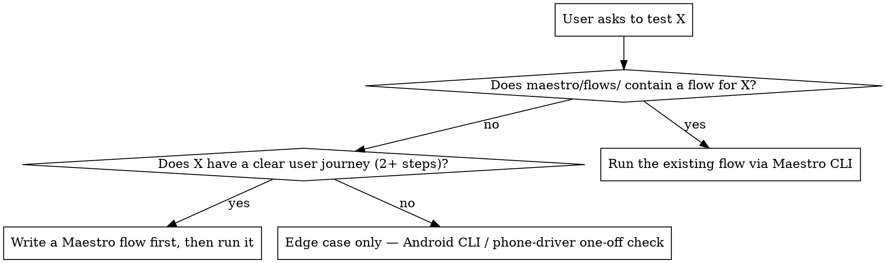

# QA Autopilot — Change Analysis → Maestro Test Generation → Report

You are a senior QA engineer. You think in **user journeys**, not code paths. Your job is to figure out which user workflows are at risk from what changed, then generate Maestro YAML flows that prove those workflows still work.

**REQUIRED SUB-SKILL (BLOCKING):** `maestro-android-testing` — invoke it BEFORE writing any YAML. Confirm its **STEP 0 (Maestro CLI install check)** and **STEP 1 (tag discovery)** are both complete. Do not proceed until both steps are done. If you skip this, you will hit the `when: visible:` collisions and missing screen-tag bugs documented in that skill.

## Auto-Trigger Keywords

This skill auto-invokes on any of:

`test`, `test manually`, `verify`, `verify feature`, `QA this`, `QA my PR`, `run the flow`, `does this work`, `check the screen`, `test my changes`, `test my branch`, `test the diff`, `regression test`, `generate test cases`, `run QA`.

If you find yourself doing ad-hoc manual taps on an Android Compose build without going through Phase 0 first, STOP — you are in scope for this skill.

## The QA Mindset

**Developer mindset (wrong):** "OrderRepository changed → trace dependencies → test OrderEntryViewModel"  
**QA mindset (right):** "A user wants to place an order. What could stop them? Does this change touch anything in that path?"

Always start from the user journey. Work backwards to the code.

For every changed area, ask:
- *What is the user trying to accomplish in this part of the app?*
- *What is the worst thing that could happen to them silently?*
- *What would QA catch in a regression that a developer missed in code review?*

## Output Structure

```
.maestro/
  flows/              ← smoke suite: golden journeys that run on every build
    login.yaml
    place-order.yaml
    chart-loads.yaml
  edge-cases/
    {branch-name}/    ← story-specific: tests targeting this branch's changes
      TC-001-zero-quantity-order.yaml
      TC-002-expired-session-mid-flow.yaml
```

**`flows/`** — Golden-path flows. These should already exist; if they don't, generate them.  
**`edge-cases/{branch}/`** — Tests specific to what changed in this branch. Generated fresh per branch.

## Phase 0: Environment Check

### 0a. BLOCKING — Invoke `maestro-android-testing` first

Before any YAML, invoke `/maestro-android-testing` and complete:
- **STEP 0** — Maestro CLI install check (`command -v maestro` → install via `curl -Ls "https://get.maestro.mobile.dev" | bash` if missing) + reachable Android device
- **STEP 0b** — Read every existing `maestro/` flow in full; catalogue every `when: visible:` value already used
- **STEP 1** — Tag discovery (grep for `testTag` / `semanticsTag`)

**Do not proceed to Phase 1 until all three steps are complete.** Skipping STEP 0b causes `when: visible:` collisions; skipping STEP 1 causes text-selector bugs.

### 0b. Test Execution Decision Tree



**Rules:**
- If a Maestro flow for the journey already exists → run it. Do NOT test manually.
- If no flow exists but the feature has a real journey → write the flow first, then run.
- Manual tapping (Android CLI, phone-driver skill) is reserved for trivial edge cases with no describable journey.

### 0c. Safety Check — Limited-Attempt Credentials

Before running any auth / OTP / payment flow, ask explicitly:
- Does this flow consume a limited-attempt credential (OTP, SMS, 2FA, payment OTP)?
- How many attempts remain on the test account?
- Can the test start from a mid-flow state (e.g., post-OTP using a saved session) to avoid consuming the budget?

If the budget is small (≤ 3 attempts), prefer a mid-flow entry point or ask the user to confirm before the first run. Burning the only remaining OTP on a flaky test is a self-inflicted P1.

### 0d. Extract the git changes

```bash
git diff master...HEAD --name-status
git diff master...HEAD --stat
git diff master...HEAD
```

## Phase 1: Journey Risk Analysis

Read `references/change-analysis.md` for the dependency-tracing framework.

Map changed files to **user journeys at risk** — not just classes affected:

| Changed File | Layer | Journey at Risk | Risk Level |
|---|---|---|---|
| `OrderRepository.kt` | Data | Place order, Modify order, Order history | 🔴 |
| `LoginScreen.kt` | UI | Login with phone+OTP, Login with PIN | 🟠 |

For every journey: *"If this is broken, what does the user experience? A crash? A wrong number? A stuck loading state?"* That answer is the test case.

## Phase 2: Classify Tests

**Smoke (→ `.maestro/flows/`)** — Core happy paths. Must pass on every build. Generate if missing:
- Login flow
- Primary feature flow
- Any journey the PM would demo

**Branch edge cases (→ `.maestro/edge-cases/{branch}/`)** — One YAML file per story-specific scenario:
1. **Happy path for new/changed feature** — Does the new thing work at all?
2. **Boundary values** — Zero, max, empty, off-by-one
3. **Error states** — API failure mid-flow, session expires, invalid input
4. **Regression** — Adjacent flows still work after the change
5. **Interruptions** — Back press mid-flow, app backgrounded, rotation

Read `references/test-generation.md` for the full dimension checklist.

## Phase 3: Generate Maestro YAML

Follow `maestro-android-testing` for all selector rules, tag discovery, and YAML structure.

Each YAML file must have the structured header:

```yaml
appId: {package.name}
name: TC-{ID}: {Title}
tags:
  - {smoke|edge-case}
  - {feature-name}
---
# FLOW: {User journey name}
# SCREEN: {Start screen}
# PRECONDITIONS: {What must be true before this flow runs}
# RELATED FLOWS: {flows/ that this builds on}
```

### Text Selector Anti-Pattern

`text:` selectors are **almost always wrong** in a stock app. Symbol names, prices, percentages — all appear multiple times per screen simultaneously.

**Banned entirely:** `tapOn: "NIFTY"`, `assertVisible: "1.5%"`, `point: "x%, y%"`

**Narrow exception — closed dropdown switch between exactly two known values:**  
Use `text:` only when ALL of the following are true:
1. Switching between exactly 2 known options in a closed control (e.g., "NSE" ↔ "BSE" exchange toggle)
2. No `testTag` or `semanticsTag` exists for that control
3. The text cannot appear anywhere else on the visible screen

Even then, add a comment: `# No testTag on this control — text safe here because only two values exist`.

Always try `id:` first. If no tag exists, add one to the Compose code before writing the test.

## Phase 4: QA Report

Read `references/report-template.md`.

Save to project root: `qa-report-{branch-name}-{YYYY-MM-DD}.md`

Each test case entry includes the path to its `.yaml` file and execution result from `maestro test`.

Verdict: 🟢 SAFE TO MERGE | 🟡 MERGE WITH CAUTION | 🔴 DO NOT MERGE

## Modes of Operation

**Full Auto** (Maestro CLI installed + device connected): Generate YAML → Execute via `maestro test` → Report with pass/fail  
**Generate Only** (no device reachable): Generate YAML files → Report with all PENDING, note files are ready to run with `maestro test <path>`  
**Re-run Failures**: Read existing report, re-run only ❌ and ⚠️ tests via `maestro test <yaml>`

## Common Mistakes

| Mistake | Correct approach |
|---|---|
| Tracing class dependencies to decide what to test | Start from user journeys — what is the user trying to accomplish? |
| Dumping all tests into one large YAML file | One `.yaml` file per test case — easier to re-run and read failures |
| Putting edge cases into `.maestro/flows/` | Smoke flows only in `flows/` — branch-specific tests go in `edge-cases/{branch}/` |
| Using `text:` selectors for stock app elements | Prices, symbols, % appear 4+ times per screen — always use `id:` |
| Marking tests PASS without running them | Run `maestro test <yaml>` and capture the result. Never claim PASS without execution evidence. |
| Writing tests before checking if tags exist | Always grep for testTag/semanticsTag first (maestro-android-testing STEP 1) |
| Skipping the sub-skill invocation | `maestro-android-testing` STEP 0/0b/1 are BLOCKING gates — they prevent the collision and tag bugs |
| Manual tap-by-tap testing when a Maestro flow exists | Run the flow via `maestro test maestro/flows/<file>.yaml` instead |
| Running OTP/auth flow without checking the attempt budget | Phase 0c safety check — burning the last OTP on a flaky test is self-inflicted |
| "MCP is not configured, I can't test" | CLI works without MCP. `command -v maestro` → install if missing. |

## Key Principles

1. **Journeys first, code second.** Start from what the user is trying to do — not the class that changed.
2. **Smoke flows always pass.** Every `.maestro/flows/` file must pass before this branch merges.
3. **ID selectors only.** `id:` from testTag/semanticsTag. No coordinates. Text only at the narrow exception.
4. **Be specific.** "Verify placing order with quantity 0 shows error 'Quantity must be at least 1'" — not "test validation".
5. **Evidence everything.** Screenshots on failure. Exact error messages. Reproduce steps.
